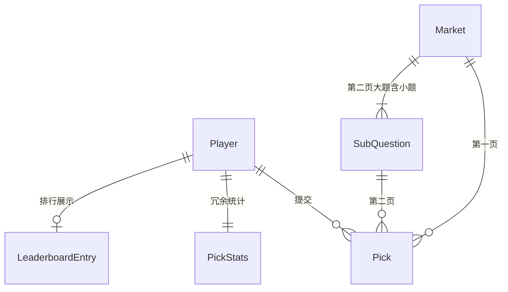

# 数据结构说明

本文档描述 Onemorecup 竞猜应用的核心数据模型与 localStorage 持久化格式。类型定义见 [`src/types.ts`](../src/types.ts)。

## 关系概览



## 类型定义

### `Player` — 玩家

```typescript
interface Player {
  id: string;           // UUID，系统内唯一身份
  name: string;         // 昵称，全局唯一（不区分大小写）
  createdAt: string;    // ISO 8601，首次提交时间
  pickStats: PickStats; // 答题数统计（保存时写入）
}
```

### `PickStats` — 答题统计

```typescript
interface PickStats {
  page1Count: number;   // 第一页已答题数（0–16）
  page2Count: number;   // 第二页已答大题数（0–8，须小题全答完）
  totalCount: number;   // page1Count + page2Count
}
```

### `Market` — 题目（大题）

```typescript
interface Market {
  id: string;                    // 如 p1-1、p2-3
  round: string;                 // 如 P1、P2
  name: string;                  // 题目标题
  page: 1 | 2;                   // 所属页
  winner: string | null;         // 第一页：结算胜者；第二页：预留
  candidates?: string[];         // 第一页：选项；第二页：可选
  subQuestions?: SubQuestion[];  // 仅第二页，默认 4 个小题
}
```

### `SubQuestion` — 第二页小题

```typescript
interface SubQuestion {
  id: string;                    // 如 p2-1-s1
  label: string;                 // 小题标题
  candidates: [string, string];  // 固定 2 个选项
  deleted: boolean;              // 管理员软删除
  winner: string | null;         // 小题结算结果
}
```

### `Pick` — 玩家答案

```typescript
interface Pick {
  playerId: string;   // 关联 Player.id
  marketId: string;   // 第一页：Market.id；第二页：SubQuestion.id
  team: string;       // 所选选项文案
  stake: 10;          // 固定下注 10 分
}
```

| 页 | `marketId` 指向 | 示例 |
|----|-----------------|------|
| 第一页 | 大题 `p1-3` | `{ playerId, marketId: "p1-3", team: "选项 A" }` |
| 第二页 | 小题 `p2-1-s2` | `{ playerId, marketId: "p2-1-s2", team: "选项 B" }` |

### `GameConfig` — 游戏配置

```typescript
interface GameConfig {
  page1Locked: boolean;  // 第一页是否锁定
  page2Locked: boolean;  // 第二页是否锁定
}
```

### `LeaderboardEntry` — 排行榜条目（计算生成）

```typescript
interface LeaderboardEntry {
  rank: number;
  playerId: string;
  name: string;
  totalScore: number;
  settledCount: number;                 // 已参与结算的项目数
  pickStats: PickStats;
  marketScores: Record<string, number>; // 第一页 key 为 marketId；第二页为 subId
}
```

### `PlayerPickInput` — 提交输入（不落库，转换为 `Pick`）

```typescript
interface PlayerPickInput {
  marketId: string;
  team: string;
}
```

## 示例数据

### 第一页大题 `p1-1`

```json
{
  "id": "p1-1",
  "round": "P1",
  "name": "题目 1（待补充）",
  "page": 1,
  "candidates": ["选项 A", "选项 B"],
  "winner": null
}
```

### 第二页大题 `p2-1`（含小题）

```json
{
  "id": "p2-1",
  "round": "P2",
  "name": "题目 1（待补充）",
  "page": 2,
  "candidates": ["选项 A", "选项 B"],
  "winner": null,
  "subQuestions": [
    {
      "id": "p2-1-s1",
      "label": "小题 1",
      "candidates": ["选项 A", "选项 B"],
      "deleted": false,
      "winner": null
    },
    {
      "id": "p2-1-s2",
      "label": "小题 2",
      "candidates": ["选项 A", "选项 B"],
      "deleted": false,
      "winner": null
    },
    {
      "id": "p2-1-s3",
      "label": "小题 3",
      "candidates": ["选项 A", "选项 B"],
      "deleted": false,
      "winner": null
    },
    {
      "id": "p2-1-s4",
      "label": "小题 4",
      "candidates": ["选项 A", "选项 B"],
      "deleted": false,
      "winner": null
    }
  ]
}
```

## localStorage 键

| 键 | 类型 | 说明 |
|----|------|------|
| `onemorecup:players` | `Player[]` | 所有玩家 |
| `onemorecup:picks` | `Pick[]` | 所有答案（扁平数组） |
| `onemorecup:markets` | `Market[]` | 24 道大题配置 |
| `onemorecup:config` | `GameConfig` | 分页锁定状态 |
| `onemorecup:leaderboard` | `LeaderboardEntry[]` | 排行榜缓存 |
| `onemorecup:currentPlayerId` | `string \| null` | 本机上次提交的玩家 ID |

读写逻辑见 [`src/lib/local-store.ts`](../src/lib/local-store.ts)。

## 数量常量

定义于 [`src/data/markets.ts`](../src/data/markets.ts)：

| 常量 | 值 | 说明 |
|------|-----|------|
| `PAGE1_COUNT` | 16 | 第一页大题数 |
| `PAGE2_COUNT` | 8 | 第二页大题数 |
| `SUBS_PER_PAGE2_QUESTION` | 4 | 每道第二页大题的小题数 |
| `TOTAL_MARKETS` | 24 | 大题总数 |
| `STAKE_PER_PICK` | 10 | 每选项下注分 |

## ID 命名约定

| 类型 | 格式 | 示例 |
|------|------|------|
| 第一页大题 | `p1-{1..16}` | `p1-1` |
| 第二页大题 | `p2-{1..8}` | `p2-3` |
| 第二页小题 | `{大题id}-s{1..4}` | `p2-3-s2` |
| 玩家 | `crypto.randomUUID()` | `f47ac10b-58cc-4372-a567-0e02b2c3d479` |

## 业务规则与数据的关系

### 第一页作答

- 玩家对 `Market.id` 提交 `Pick`
- 选了任意选项（非「不选」）即 `page1Count` +1

### 第二页作答

- 玩家对各 `SubQuestion.id` 分别提交 `Pick`
- 仅当该大题下所有 `deleted === false` 的小题都有 `Pick` 时，`page2Count` +1
- 管理员将小题标记 `deleted: true` 后，该小题不再要求作答；若剩余小题均已答，大题视为完成

### 玩家识别

- 数据层以 `Player.id`（UUID）为主键
- 展示与匹配使用 `Player.name`（昵称唯一，不区分大小写）
- 本机通过 `onemorecup:currentPlayerId` 记住上次提交的玩家

### 计分

- 第一页：按 `Market.winner` 对该题的 `Pick` 结算
- 第二页：按各 `SubQuestion.winner` 对小题 `Pick` 结算；仅当玩家已完成对应大题时计入
- 结算逻辑见 [`src/lib/scoring.ts`](../src/lib/scoring.ts)

## 相关文件

| 文件 | 职责 |
|------|------|
| `src/types.ts` | 类型定义 |
| `src/data/markets.ts` | 默认题目与常量 |
| `src/lib/local-store.ts` | 持久化与 CRUD |
| `src/lib/pick-stats.ts` | 答题数统计 |
| `src/lib/market-helpers.ts` | 第二页完成判定 |
| `src/lib/scoring.ts` | 计分与排行榜生成 |
