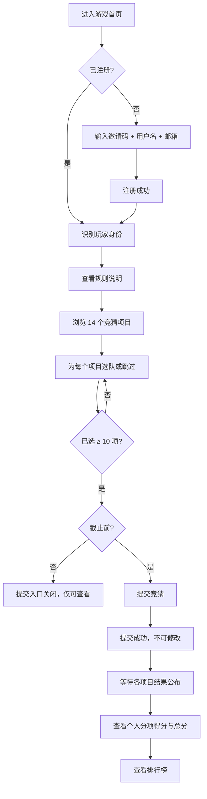
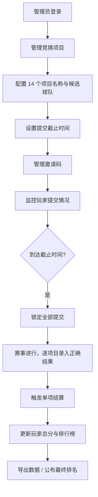

# 世界杯竞猜小游戏 — 产品需求文档（PRD）

## 文档状态

| 版本 | 日期 | 说明 |
|------|------|------|
| 1.0 | 2026-06-06 | 初稿定稿 |

---

## 1. 产品概述

玩家在 **1/8 决赛开赛前** 提交竞猜。系统共设置 **14 个独立竞猜项目**，玩家对每个项目可选 1 支球队，也可跳过。已选项目视为各下注 **10 分**。玩家至少需完成 **10 个项目** 的竞猜方可提交。各项目独立结算，**总分最高者获胜**。

---

## 2. 已确认决策

| # | 事项 | 结论 |
|---|------|------|
| 1 | 14 个竞猜项目的具体内容 | **待定**（由管理员后续配置） |
| 2 | 「所有参与者」的定义 | **在该项目有选队的玩家**，不含跳过者 |
| 3 | 同分处理 | **排名相同**（并列，不按时序区分） |
| 4 | 仅 1 人参与时全员同对/同错得 0 分 | **符合预期** |

---

## 3. 核心规则

| 规则项 | 说明 |
|--------|------|
| 提交截止 | 1/8 决赛开赛前（可配置具体时间点） |
| 竞猜项目数 | 14 个，彼此独立 |
| 单项目选择 | 选 1 支球队，或不选 |
| 下注单位 | 每选一个项目 = 下注 10 分 |
| 最低参与 | 至少竞猜 10 个项目（最多 14 个） |
| 结算方式 | 按项目独立结算，再汇总总分 |
| 获胜条件 | 总分最高者获胜；同分并列 |

---

## 4. 玩家流程



### 4.1 详细步骤

1. **进入游戏** — 打开首页，可切换语言。
2. **注册** — 输入邀请码、用户名、邮箱；同一邮箱仅允许注册一次。
3. **阅读规则** — 查看计分规则、截止时间、14 个项目说明。
4. **填写竞猜** — 对 14 个项目逐一选队或跳过；实时显示已选项目数（≥ 10 方可提交）。
5. **提交** — 截止前一次性提交，提交后不可修改。
6. **赛后查看** — 查看各项目得分明细与排行榜（仅显示用户名，不公开邮箱）。

### 4.2 玩家约束

- 每名玩家仅可提交 **1 份** 竞猜。
- 跳过的项目不参与该项目的输赢结算（得分为 0）。
- 截止后不可新增或修改。

---

## 5. 管理员流程



### 5.1 详细步骤

1. **登录后台** — 使用管理员凭证进入管理界面。
2. **配置竞猜项目** — 设置 14 个项目的名称、描述、候选球队（具体内容待定）。
3. **设置截止时间** — 默认为 1/8 决赛首场开球时间，支持手动调整。
4. **邀请码管理** — 创建/停用邀请码，追踪来源渠道。
5. **监控提交** — 查看已提交人数、各项目选队分布。
6. **录入正确结果** — 每个项目对应 1 支正确球队，录入后触发该项目结算。
7. **结算与公布** — 计算各项目得分，汇总总分，刷新排行榜。
8. **数据导出** — 导出玩家提交、分项得分、总分排名。

---

## 6. 计分规则

### 6.1 基本原则

- 每个项目 **独立结算**，互不影响。
- **参与者** = 在该项目有选队的玩家；**跳过者得 0 分**，不参与该项目结算。
- 每个已选玩家在该项目的下注额固定为 **10 分**。

设：

- `P` = 在该项目有选队的玩家集合
- `correct` = 管理员录入的正确球队
- `correct_pool` = 猜对者
- `wrong_pool` = 猜错者

### 6.2 结算逻辑

**规则 A — 全员同对或同错**

> 若 `P` 中 **所有参与者都猜对**，或 **都猜错** → `P` 中每人该项目得 **0 分**。  
> （含仅 1 人参与的情形。）

**规则 B — 有对有错**

> 若 `P` 中同时存在猜对和猜错：
>
> - 猜错方：每人 **-10 分**
> - 猜对方：平分猜错方总损失
>
> $$\text{每人得分} = \frac{|\text{wrong\_pool}| \times 10}{|\text{correct\_pool}|}$$

### 6.3 计分示例

| 场景 | 玩家选择 | 正确结果 | 该项目得分 | 适用规则 |
|------|----------|----------|------------|----------|
| 全员猜对 | A/B/C 均选巴西 | 巴西 | 各 **0** | A |
| 全员猜错（同队） | A/B/C 均选阿根廷 | 巴西 | 各 **0** | A |
| 全员猜错（不同队） | A 阿根廷，B 法国，C 德国 | 巴西 | 各 **0** | A |
| 有对有错 | A 阿根廷，B/C 巴西 | 巴西 | A **-10**，B/C 各 **+5** | B |
| 两人对一人错 | A 阿根廷，B 巴西 | 巴西 | A **-10**，B **+10** | B |
| 仅 1 人参与且猜对 | A 巴西，其余跳过 | 巴西 | A **0** | A |
| 仅 1 人参与且猜错 | A 阿根廷，其余跳过 | 巴西 | A **0** | A |
| 跳过 | A 巴西，B 跳过 | 巴西 | A 按规则结算，B **0** | — |

### 6.4 总分与排名

$$\text{玩家总分} = \sum_{i=1}^{14} \text{项目 } i \text{ 得分}$$

- 按总分 **降序** 排列。
- **同分者排名相同**（并列，不按提交时间区分）。
- 示例：第 1 名 120 分，第 2–3 名均 100 分，下一名为第 4 名。

### 6.5 风险说明（面向玩家展示）

- 每选一个项目，最坏情况在该项损失 **10 分**。
- 选满 14 项时，可展示「已选 N 项」提示，帮助玩家评估参与规模。

---

## 7. 数据结构

### 7.1 竞猜项目 `PredictionItem`

```typescript
interface PredictionItem {
  id: string;                   // 项目 ID
  title: LocalizedText;         // 项目名称（多语言）
  description?: LocalizedText;
  candidateTeamIds: string[];   // 可选球队 ID 列表
  correctTeamId: string | null; // 管理员录入，未公布前为 null
  settledAt: string | null;     // 结算时间
  order: number;                // 展示顺序 1–14
}
```

### 7.2 球队 `Team`

```typescript
interface Team {
  id: string;
  name: string;
  names: LocalizedText;
}
```

### 7.3 玩家选队 `Pick`

```typescript
interface Pick {
  itemId: string;
  teamId: string | null;        // null = 不选
}
```

### 7.4 玩家提交 `Submission`

```typescript
interface Submission {
  id: string;
  userName: string;
  email: string;                // 仅后台可见
  inviteCode: string;
  source: string;               // 邀请码来源渠道
  picks: Pick[];                // 长度 14
  pickedCount: number;          // 非 null 的 pick 数量，≥ 10
  itemScores: Record<string, number>;
  totalScore: number;
  rank: number;                 // 并列同 rank
  createdAt: string;
  locked: boolean;              // 截止后 true
}
```

### 7.5 邀请码 `InviteCode`

```typescript
interface InviteCode {
  code: string;
  source: string;
  label: string;
  active: boolean;
}
```

### 7.6 游戏配置 `GameConfig`

```typescript
interface GameConfig {
  submissionDeadline: string;   // ISO 8601
  minPicks: 10;
  maxPicks: 14;
  stakePerPick: 10;
  itemCount: 14;
}
```

### 7.7 排行榜公开数据 `PublicLeaderboardEntry`

```typescript
interface PublicLeaderboardEntry {
  rank: number;
  userName: string;
  pickedCount: number;
  totalScore: number;
}
```

### 7.8 存储建议

| 实体 | 本地开发 | 生产环境 |
|------|----------|----------|
| Submission | `.data/submissions.json` | PostgreSQL |
| PredictionItem | `.data/items.json` | 数据库表 |
| GameConfig | 环境变量 + 配置文件 | 数据库 / 环境变量 |

---

## 8. 页面列表

### 8.1 玩家端

| 页面 | 路由（建议） | 功能 |
|------|--------------|------|
| 游戏主页 | `/` | 注册、14 项竞猜、提交 |
| 规则说明 | `/` Tab 或 `/rules` | 计分规则、截止时间、项目说明 |
| 排行榜 | `/` Tab 或 `/leaderboard` | 总分排名（并列同 rank，仅用户名） |
| 个人成绩 | `/` 展开或 `/me` | 各项目选队、分项得分、总分 |

**主页核心模块：**

- 语言切换
- 注册表单（邀请码 / 用户名 / 邮箱）
- 14 项竞猜选择器
- 已选计数与提交校验（≥ 10 项）
- 提交状态提示

### 8.2 管理端

| 页面 | 路由（建议） | 功能 |
|------|--------------|------|
| 管理员登录 | `/admin/login` | 身份验证 |
| 控制台首页 | `/admin` | 提交数、截止倒计时 |
| 项目管理 | `/admin/items` | 配置 14 个项目与候选球队 |
| 结果录入 | `/admin/results` | 录入正确球队并结算 |
| 玩家管理 | `/admin/players` | 查看提交、选队分布、导出 |
| 邀请码管理 | `/admin/invites` | 增删停用邀请码 |
| 系统设置 | `/admin/settings` | 截止时间、多语言文案 |

### 8.3 API 端点（建议）

| 方法 | 路径 | 说明 |
|------|------|------|
| POST | `/api/register` | 注册并提交竞猜 |
| GET | `/api/leaderboard` | 获取排行榜 |
| GET | `/api/items` | 获取 14 个项目（不含正确答案） |
| GET | `/api/config` | 获取截止时间等配置 |
| POST | `/api/locale` | 切换语言 |
| POST | `/api/admin/results` | 管理员录入结果并结算 |
| GET | `/api/admin/submissions` | 管理员查看全部提交 |

---

## 9. 校验与异常

| 场景 | 处理 |
|------|------|
| 已选 < 10 项 | 禁止提交，前端 + 后端双重校验 |
| 重复邮箱 | 拒绝注册，提示已参与 |
| 超过截止时间 | 关闭提交，仅可查看 |
| 项目未录入结果 | 该项目得分暂为 0 或「待结算」 |
| 管理员修改已结算项目 | 需二次确认，记录审计日志并重新计算总分 |

---

## 10. 仍待定

- **14 个竞猜项目的具体内容** — 管理员配置时补充
